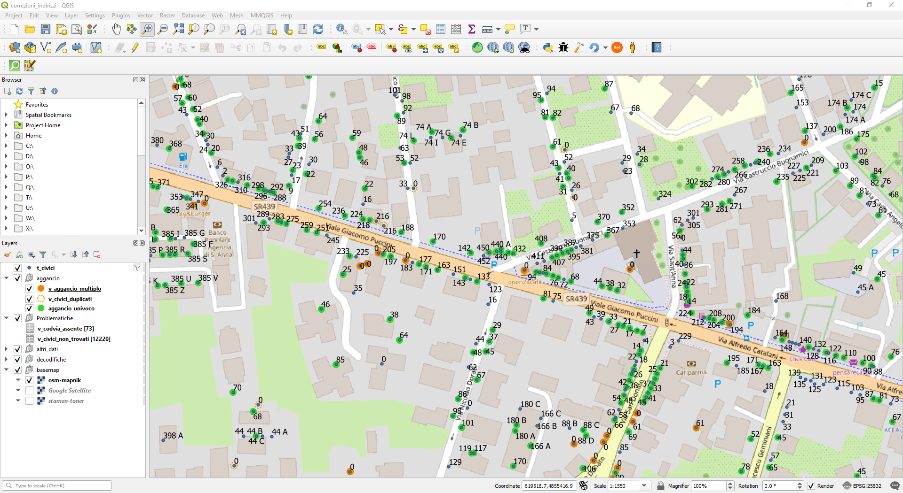
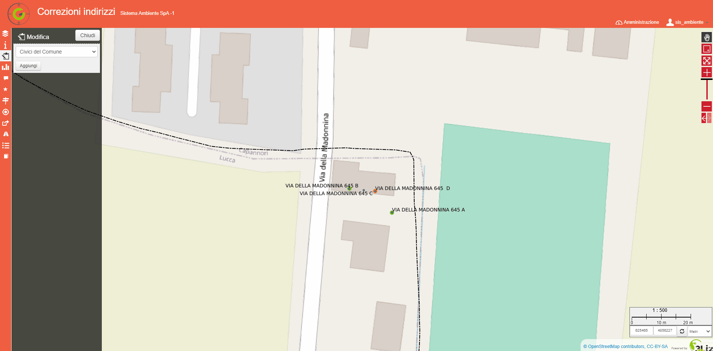
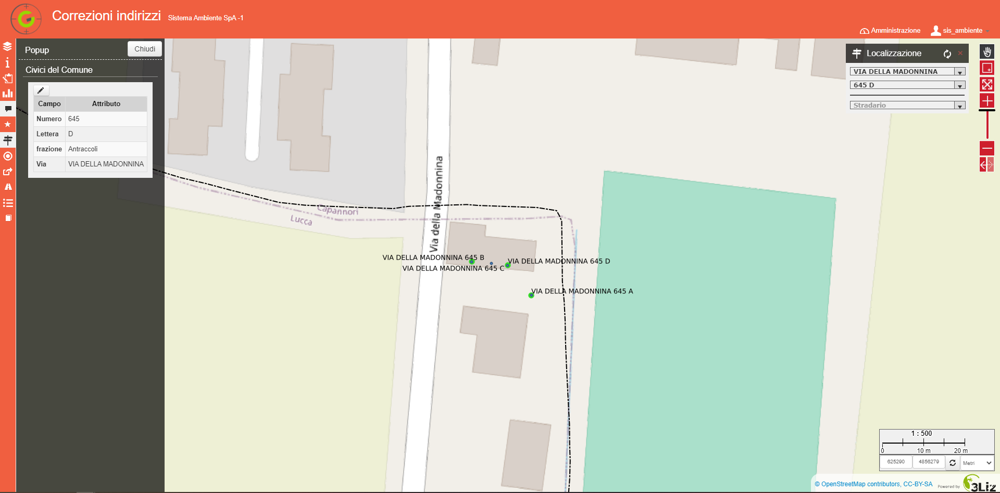

Funzionalità di editing 
==================

Editing dei Percorsi
------------------------
On line o in ambiente desktop tramite il progetto QGIS dedicato: percorsi.qgs
Da completare

Editing degli indirizzi
------------------------

Le problematiche
+++++++++++++++++++++++
L'indirizzario comunale (tabella t_civici) è alla base della localizzazione degli indirizzi delle utenze servite dal servizio di raccolta rifuiti porta a porta.
In fase di implementazione delle query che consente di agganciare le anagrafiche con gli indirizzi della banca dati comunale sono emerse una serie di criticità che richiedeno interventi correttivi.
Le chiavi di aggancio impiegate sono Codice Via Comunale, Numero civico , Esponente.

I possibili esiti di questa operazione sono stati suddivisi in più layer per una più agevole consultazione:

* aggancio univoco:  relazione 1:1 tra l'indirizzo in anagrafica e indirizzario comunale

* aggancio fallito: non è possibile trovare una corrispondenza 

* aggancio fallito per via assente nell'indirizzario: non è possibile trovare una corrispondenza e non è possibile trovare la via nell'indirizzario

* agganci multipli: relazione 1:n tra l'indirizzo presente in anagrafica e indirizzo presente tra i civici del comune dovuto alla presenza di duplicati nell'indirizzario comunale. In altri termini, a parità di codvia, numero civico, esponente sono presenti record con posizioni (geometrie) differenti. 

Cosa modificare 
+++++++++++++++++++++++
Di volta in volta sarà necessario valutare se modificare i dati relativi alle anagrafiche dei clienti o la banca dati degli indirizzi comunali. 
Le correzioni degli indirizzi associati alle anagrafiche devono essere effettuate tramite il gestionale ad uso interno.
Per correzioni degli indirizzi comunali è possibile lavorare on line o in ambiente desktop tramite il progetto QGIS dedicato: correzioni_indirizzi.qgs

Il progetto QGS per la correzione degli indirizzi
+++++++++++++++++++++++

Si descrivono di seguito i pricipali layer caricati nel progetto :

* Civici del Comune (t_civici) : tutti gli indirizzi presenti nell'indirizzario comunale (Centro Storico escluso) sono rappresentati sulla mappa con un circoletto piccolo blu
* Aggancio univoco (v_aggancio_univoco) : gli indirizzi per cui l'aggancio anagrafica-civici ha esito positivo sono rappresentaati con circoletto verde
* Aggancio multiplo (v_agganci_multipli) :  gli indirizzi per cui l'aggancio anagrafica-civici produce più candidati sono rappresentaati con un circoletto arancione
* Civici duplicati (v_civici_duplicati) : per evidenziare la casistica precedente anche in assenza di anagrafiche da agganciare gli indirizzi duplicati nella banca dati comunale   sono rappresentati con un circoletto arancione tratteggiato
* Aggancio fallito(v_civici_non trovati) : tabella alfanumerica con indicazione del numero di contratto 
* Aggancio per via assente nell'indirizzario (v_codvia_assente) : tabella alfanumerica con indicazione del numero di contratto 
Gli altri layer (stradario, limiti amministrativi,  frazioni, ) servono, al bisogno, ad inqauadrare il contesto territoriale.

Gli unici layer editabili sono Civici del Comune (t_civici) e la tabella alfanumerica dello Stradario (stradario_comunale).

La maschera di editing dell'indirizzario richiede di compilare i seguenti campi:

* Via: obbligatorio, è possibile scegliere la denominazione della via da un elenco a discesa che compare non appena si inizia a digitare la prima lettera
* Numero : il numero civico, obbligatorio
* Lettera : l'espondente, non obbligatorio
Il campo flag_modificato serve ad individuare le correzioni effettuate alla banca dati comunale, è un booleano e non è editabile perchè popolato automaticamente in caso di inserimento di un nuovo record o di modifica di un record esistente.

La modifica dello Stradario comunale è da utilizzare solo nel caso in cui, a causa di mancato aggiornamento della fonte dati, fosse necessario inserire nuove strade o modificare la donominazione di strade esistenti.

Le correzioni
+++++++++++++++++++++++
Di seguito gli step per procedere alla correzione degli indirizzi:

#. Accedere al panello Dati per consultare la tabelle delle problematiche.
#. Selezionare il tipo di problematica che si vuole correggere selezionando la tabella corrispondente. 
#. Accedere alla tabella Aggancio Fallito e individuare il record per cui si intende effettuare la correzione.
#. Effettuare la ricerca con il pannello Localizzazione (posto in alto a destra sull'area di mappa) inserendo la Via e il Numero civico più prossimo a quello cercato. Nel caso      della tabella relativa alla problematica Aggancio fallito per via assente nell'indirizzario, utilizzare la Localizzazione tramite Stradario inserendo la sola Via.
#. Attivare la funzione Street View per una verifica della presenza del Civico o verificare l'ubicazione del civico sul campo.
#. Verificare l'indirizzo di fatturazione sulla banca dati interna. 

.. image:: img/locate_address.gif

I possibili scenari sono:

#. Indirizzo in anagrafe corretto non presente in indirizzario comunale
   Soluzione: Inserimento nuovo indirizzo

#. Indirizzo nel database comunale non corretto
   Soluzione: Modifica indirizzo nella banca dati comunale

#. Indirizzo in anagrafe non corretto (es. esponente assente) ma presente in indirizzario comunale
   Soluzione: Modifica anagrafica tramite gestionale ad uso interno

Modifica indirizzo esistente 
+++++++++++++++++++++++
Selzionare il punto sulla mappa che si vuole modificare. Abilitare la modifica cliccando sul simbolo della matita. Modificare i dati tramite il pannello di Modifica e salvare.  Il flag_modificato verrà popolato automaticamente.

Dopo aver ricaricato la pagina è possibile visualizzare gli effetti della modifica. L'indirizzo modificato è ora correttamente agganciato ed è possibile trovarlo tramite il pannello di Localizzazione.

Inserimento nuovo indirizzo
+++++++++++++++++++++++

Arire il pannello di Modifica tramite la toolbar laterale e selezionare dal menù a tendina il layer Civici del comune. Premere il tasto "Aggiungi". Disegnare la geometria sulla mappa, è sufficiente un solo click del mouse. La nuova geometria puo essere spostata tenendo premuto il tasto sinistro del mouse. Inseire i dati richiesti: Via, numero, lettera e premere il tasto salva per salvare. Il flag_modificato verrà popolato automaticamente.

Modifica anagrafica tramite gestionale
+++++++++++++++++++++++
Le tabelle delle problematiche contengono il numero identificativo del contratto (numcom) per consentire un'agevole individuazione dell'anagrafica.
I dati dell'anagrafica vengono sincornizzati periodicamente con il GeoDB collegato all'applicativo GIS/WebGIS. Le eventuali modifiche apportate tramite il gestionale TIA sono visibili solo a partire della sincronizzazione successiva.

